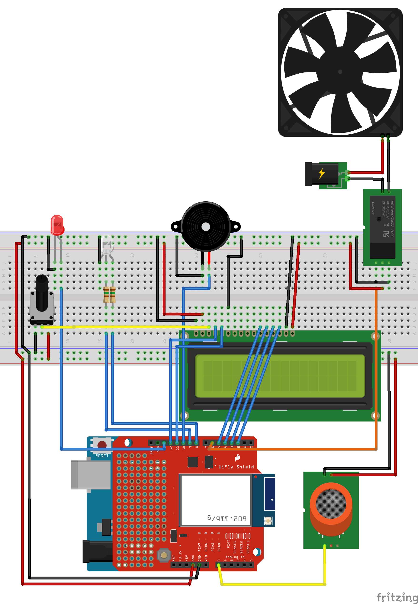
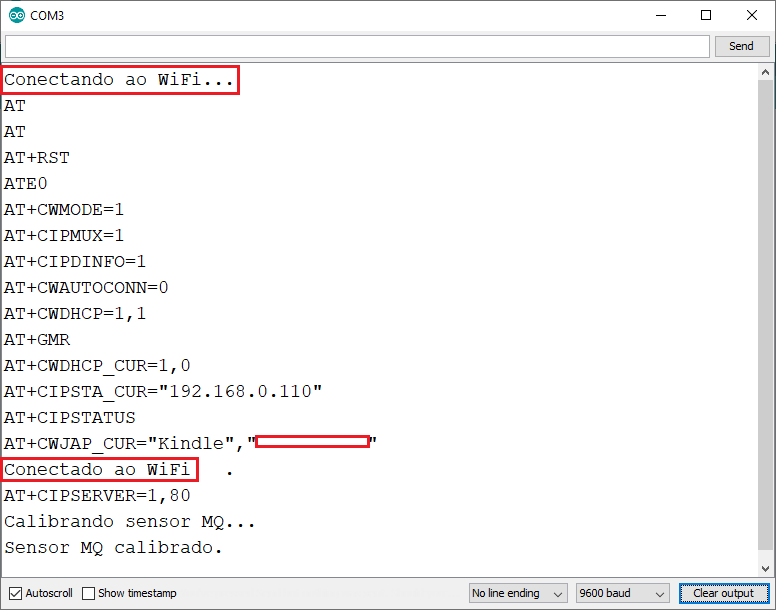
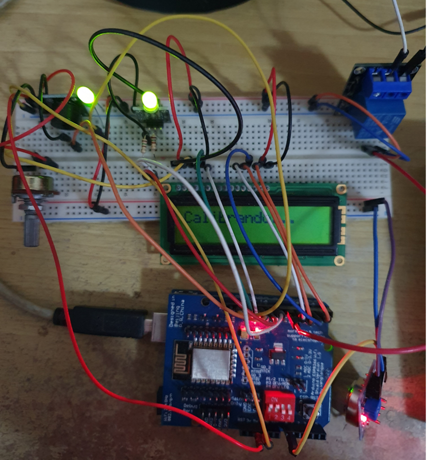
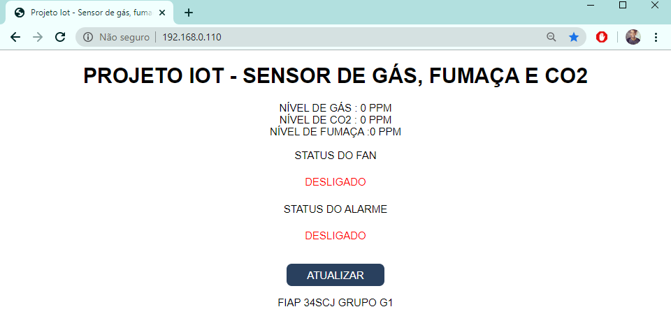

# Documentação do projeto IoT

## Introdução

Este projeto consiste na utilização de um controlador Arduíno UNO, equipado com um sensor de gás (entre eles fumaça e CO2), para o auxílio na prevenção de acidentes que tenham como causa incêndio, vazamento de elementos tóxicos num ambiente controlado.

O cálculo é realizado em valores de PPM (Partes Por Milhão) e enviados à um webservice, que realiza a manipulação das informações. Neste estudo de caso, as informações são exibidas num dashboard.

## Componentes utilizados
1. Arduino Uno
2. Shield WiFi ESP8266 Módulo ESP-12E
3. Sensor de Gás, CO2 e Fumaça MQ-2
4. Display LCD 2x16
5. Potenciômetro
6. Módulo relê KY-019
7. Módulo led de 2 cores (Verde e vermelho)
8. 1 LED verde
9. 1 módulo buzzer
10. 2 resistores de 150 omhs
11. 1 FAN de computador de 12V
12. Fonte de alimentação externa de 12V

## Arquitetura da Solução

## Como o protótipo funciona
1. A primeira tarefa é conectar-se à rede WiFi que foi configurada com os respectivos nome e senha. Neste momento o módulo LED de duas cores terá sua cor vermelha ligada quando estiver desconectado e ao se conectar mudará para verde.

2. O segundo passo é calibrar o sensor MQ-2. Levará alguns segundos e ao finalizar a calibragem o LED verde desligará. Durante essa etapa será exibido no display LCD que está sendo calibrado e após finalizar já exibirá o nível de gás do ambiente.

3. Após a conexão ao WiFi e calibrangem feita, basta acessar o no navegador o endereço `http://192.168.0.110` nesse momento será feito uma requisição HTTP get que enviará os valores em PPM de gás, CO2 e fumaça que o sensor está capturando.

4. Ao clicar em `ATUALIZAR`, o Shield WiFi ESP8266 envia um requisição GET http para atualizar a página.

5. Ao detectar um dos elementos (gás, CO2 ou fumaça), o alarme e o FAN serão ativados. Para exibir na página HTTP é necessário fazer uma nova requisição.

Vídeo demonstrativo: Https://

## Equipe
| Nome | Matrícula |
| ------ | ------ |
| Ana Carla Brasil   | 334056 |
| Edson Raimundo Jr. | 333819 |
| Hugo Destito       | 333823 |
| Richel Sensineli   | 333805 |

